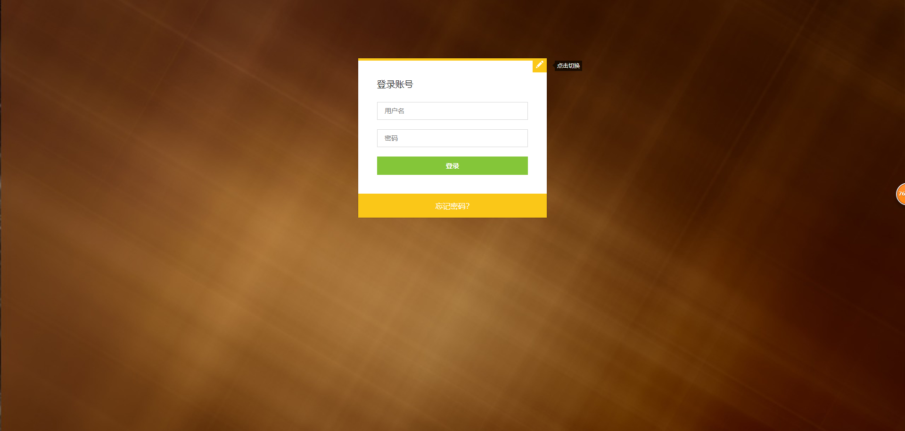
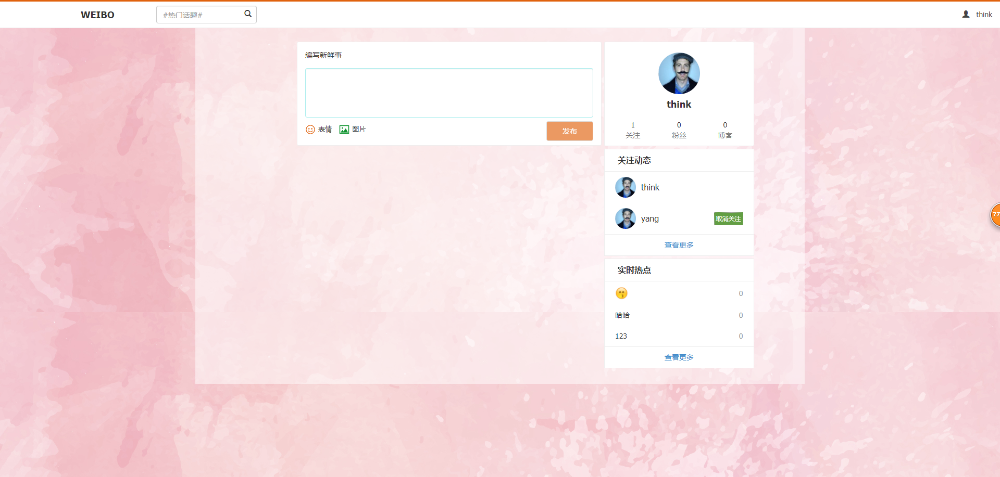

# 基于redis数据库的简易博客

一个 基于PHP + CI框架 + redis数据库的简易博客

## 更新

- 2019-01-16 新增关注

## 使用

- 下载源码

- 开启redis服务器

- 访问：http://localhost/blog/login/index

## 界面

具体设计可查看我的博客：[PHP 之基于redis数据库的简易博客](https://www.cnblogs.com/yang-2018/p/12199888.html)
